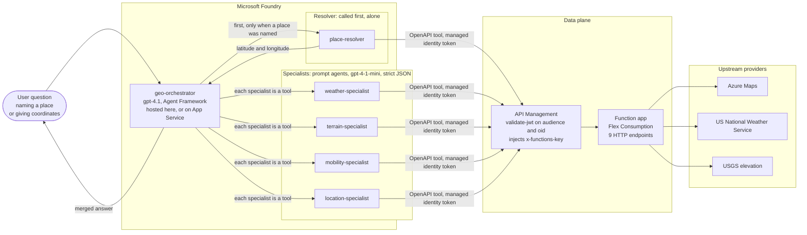
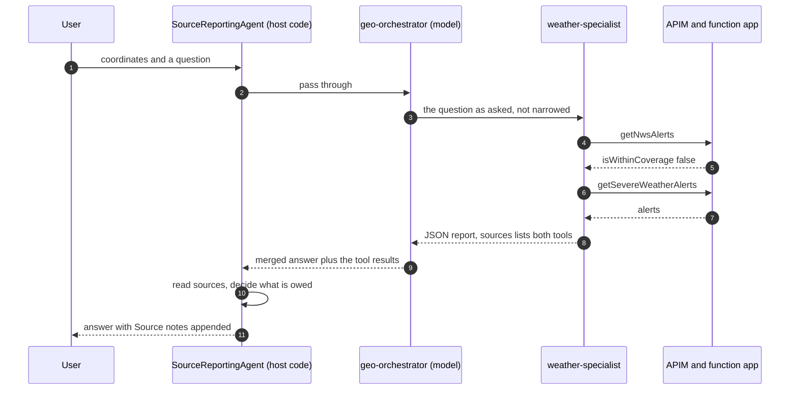
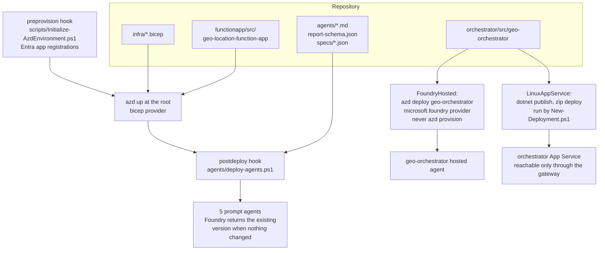

# Geo-Location Agents

A geospatial question answering system. A user asks about a point on the ground, specialist agents
each answer for the domain they own, and an orchestrator merges those answers into one report that
states what is known, what is missing, and where it came from.

The .NET 10 Azure Functions application in `functionapp/src/geo-location-function-app` is the data layer underneath all of
that. Each endpoint is independent and does exactly one thing: it retrieves data from a single
upstream source and returns it. Nothing in this application decides whether a site is reachable or
serviceable. Every judgment of that kind is made above it, by the agents.

## How it works

Five specialist agents sit between the orchestrator and the data. Each one owns a domain, holds only
the tools for that domain, and returns a fixed JSON report rather than prose. The orchestrator has no
data of its own and no tools other than the specialists themselves.

Four of them answer questions about a coordinate. The fifth, the place resolver, is the only way to
obtain one: it turns a written place name or address into latitude and longitude. When a question
names a place instead of giving numbers, the orchestrator calls the resolver first and alone, then
fans out to the others with what it returned. Nothing in the system may write a coordinate that no
tool produced.



The specialists never hold a key. The Foundry account's system-assigned managed identity requests a
token for the gateway's audience, API Management validates it and pins the caller's object id, and
only then adds the function host key. The key exists on one hop that the agents cannot see.

### Where the orchestrator runs

The orchestrator is an ordinary ASP.NET Core app either way. AgentHost serves the OpenAI Responses
protocol at `/responses` whatever it is running on, so the binary is identical and only the address
callers use changes.

| | `FoundryHosted` | `LinuxAppService` |
|---|---|---|
| Runs on | Foundry Agent Service | Linux App Service behind API Management |
| Runs as | the agent's own identity | a user-assigned identity granted Azure AI User on the account |
| Callers reach | the Foundry agent endpoint | `https://<gateway>/orchestrator/responses` |
| Published by | `azd deploy geo-orchestrator` | `dotnet publish` and zip deploy |

`main.bicep` chooses from `environment().name` rather than from an argument, because the Agent
Service is commercial-only today and the right answer is a property of the cloud. `-OrchestratorHost`
overrides it in either direction, which is the only way to exercise the App Service path from
commercial.

Self-hosted, the App Service is not open to the internet. It requires an Entra token whose `oid` is
the gateway's managed identity, and the gateway obtains that itself with
`authentication-managed-identity` after validating the caller's own token against a separate
audience. The two audiences are what stop a token minted for one hop being replayed against the
other, and a request that skipped the gateway cannot satisfy the second check at all.

Authorizing by caller identity rather than by source address is deliberate. An address allowlist
reads as equivalent but fails open: the gateway's public IP is not exposed on every API Management
tier, and an unresolved address leaves the app reachable by anyone.

### What one question does

The interesting part is the last two steps. A specialist records the tools that actually answered in
the `sources` field of its report, and the host reads that off the tool results and appends the
resulting limitation itself. Asking the model to state it produced it in four runs out of five, which
is not a rate to put behind a heat warning.



A London coordinate sits outside both USGS elevation coverage and the National Weather Service, so a
correct answer reports the elevation gap and attributes the alert to the worldwide feed. A Seattle
coordinate must produce neither. The rule lives in
[SourceNotices.All](orchestrator/src/geo-orchestrator/SourceNotices.cs) and is unit tested; the model
is told not to describe where data came from, so the statement has one author and one wording.

### How it gets deployed

Two azd projects, because one project cannot use both providers. The specialists are published by a
postdeploy hook so they are never pointed at a gateway that has no code behind it yet. The App
Service path is not an azd service at all: azd deploys every service it is given on every run, and
there is no conditional form of that, so publishing it is left to the deployment script.



### Adding an endpoint

The gateway's OpenAPI document is built from `specs/*.json` and embedded in the template with
`loadTextContent`, so a new path is only real once Bicep has been redeployed. Adding one to an
existing environment means:

```powershell
./apim/build-openapi.ps1                              # merge specs/*.json into apim/geo-api.openapi.json
azd provision                                         # APIM imports the merged document
./agents/deploy-agents.ps1                            # publish the agent that owns the new tool
azd deploy geo-orchestrator --cwd orchestrator        # only if the orchestrator changed
```

`apim/apply-policy.ps1` is not part of this. The policy is applied at API scope rather than per
operation, so a new operation inherits it without being named anywhere.

### Deploying into an empty subscription

`infra/main.bicep` creates everything: the resource group, Log Analytics, storage, the Flex
Consumption plan, App Insights, the Azure Maps account, the function app, the API Management
instance, and the Foundry account, project, and both model deployments. No resource is referenced as
pre-existing, so the only inputs are a subscription, a tenant, a region, and a resource group name.

Resource names are derived from the environment name and a hash of the subscription and region, so
nothing has to be chosen or reserved up front.

[scripts/New-Deployment.ps1](scripts/New-Deployment.ps1) runs the whole sequence — both sign-ins,
both azd environments, and both projects in the order they depend on each other:

```powershell
./scripts/New-Deployment.ps1 `
    -TenantId <tenant-id> `
    -SubscriptionId <subscription-id> `
    -NwsUserAgent 'GeoLocation (you@example.com)' `
    -ApimPublisherEmail you@example.com
```

There is nothing to edit first. Every value is held in the azd environment, which is what
[infra/main.parameters.json](infra/main.parameters.json) substitutes into Bicep, so retargeting a
different subscription or tenant means different arguments rather than a changed file.

| Value | Argument | Default |
|-------|----------|---------|
| Tenant | `-TenantId` | required |
| Subscription | `-SubscriptionId` | required |
| NWS contact string | `-NwsUserAgent` | required; the National Weather Service blocks callers that omit it |
| APIM notification address | `-ApimPublisherEmail` | required by the ARM resource |
| Environment name | `-EnvironmentName` | `geo-agents-dev` |
| Region | `-Location` | `eastus` |
| Cloud | `-Cloud` | `AzureCloud` |
| Resource group | `-ResourceGroupName` | `rg-<environment name>` |
| APIM tier | `-ApimSku` | `Developer` |
| Orchestrator host | `-OrchestratorHost` | `Auto`, resolved from the cloud |
| Existing gateway audience | `-GeoApiAudience` | created by the preprovision hook |

Everything else — `GEO_API_BASE_URL`, `FOUNDRY_PROJECT_ENDPOINT`, the function app name, the
principal ids — is a Bicep output that azd writes back into the environment, and the script reads it
from there when it configures the orchestrator. Pass `-ConfigureOnly` to populate the environment
and stop before anything is provisioned, or `-SkipOrchestrator` to stop after the backend.

Both CLIs have to be signed in to the same tenant, which is why the script does both: azd
provisions, but the preprovision and postdeploy hooks call `az`. Signing in to only one produces a
deployment that fails at a hook rather than at the start.

Two things are not ARM resources and so are handled outside the template. The two Entra app
registrations whose App ID URIs the gateway validates — one for the geo API the specialists call,
one for the orchestrator API in front of the App Service — are created by the preprovision hook,
which needs the Entra Application Developer role the first time it runs in a tenant; pass
`-GeoApiAudience` to reuse one that already exists instead. The orchestrator's app also exposes a
`user_impersonation` scope and pre-authorizes the Azure CLI, so a signed-in user can call it without
an administrator consenting to the API first. And Foundry data-plane access is not implied by
subscription Owner, so the template grants the deploying principal Foundry User and Foundry Project
Manager on the account — without those the postdeploy hook cannot publish the specialists.

Budget for the wait. API Management Developer takes 30 to 45 minutes to provision and has no SLA. It
is the cheapest tier that still supports the `rate-limit-by-key` policy this API applies; Consumption
does not support that policy at all. `-ApimSku Basicv2` trades cost for a deployment that finishes in
minutes.

### Sovereign clouds

No hostname in the templates is written as a commercial literal. Storage, the function app, and the
gateway URLs are read back from the resources that own them, the Entra authority comes from
`environment()`, and the rest resolve from the cloud being deployed to. Set any of these only to
override that:

| azd variable | Bicep parameter | Commercial | Azure Government |
|--------------|-----------------|------------|------------------|
| `AZURE_MAPS_ENDPOINT` | `azureMapsEndpoint` | `https://atlas.microsoft.com` | `https://atlas.azure.us` |
| `AI_SERVICES_DOMAIN` | `aiServicesDomain` | `azure.com` | `azure.us` |
| `MODEL_DEPLOYMENT_SKU` | `modelDeploymentSku` | `GlobalStandard` | `Standard` |
| `ENTRA_V1_ISSUER` | `entraV1Issuer` | `https://sts.windows.net/` | unchanged |

`-Cloud` sets the cloud for azd and the Azure CLI, which default to commercial independently of one
another. The Foundry data-plane hostname and the token audience the agent scripts request are both
derived from `aiServicesDomain`, so they follow it without a second setting:

```powershell
./scripts/New-Deployment.ps1 `
    -TenantId <tenant-id> `
    -SubscriptionId <subscription-id> `
    -NwsUserAgent 'GeoLocation (you@example.com)' `
    -ApimPublisherEmail you@example.com `
    -Cloud AzureUSGovernment `
    -Location usgovvirginia
```

Two differences are not configuration. `GlobalStandard` does not exist in Azure Government, so the
model deployments fall back to `Standard`, which `gpt-4.1` and `gpt-4.1-mini` at version
`2025-04-14` both support in US Gov Virginia. And the API Management v2 tiers are commercial-only,
so `-ApimSku Basicv2` is rejected outside commercial and the Developer tier's 30-to-45-minute
provision applies.

The Foundry Agent Service is the one component with no Gov presence. Azure Maps, Azure OpenAI, API
Management, Functions, and Entra are all available in US Gov Virginia, but the Agent Service region
tables list no Gov regions, and the hosted orchestrator depends on it. That is what the orchestrator
host selection exists for: `main.bicep` resolves a Gov deployment to `LinuxAppService`, which runs
the identical binary on an App Service behind the same gateway, so nothing else in this section
needs a Gov variant. The specialists, the gateway, and the function app are unaffected either way.

[scripts/Remove-Deployment.ps1](scripts/Remove-Deployment.ps1) is the reverse, and covers the four
things `azd down` leaves behind: the Entra app registrations, both local azd environments, the agent
identities Foundry mints per published agent, and the soft-deleted Foundry account and API Management
instance, which otherwise keep their names reserved and their model quota allocated against a
redeploy of the same environment name.

```powershell
./scripts/Remove-Deployment.ps1 -EnvironmentName geo-agents-dev
```

It prompts before deleting anything; `-WhatIf` reports the target and stops, and `-Force` skips the
prompt. Pass `-KeepAppRegistration` when an app was supplied through `-GeoApiAudience` rather than
created by the hook, or `-KeepEnvironmentFiles` to delete the Azure resources but keep the settings
for a redeploy. `-Cloud` has to match the cloud the environment was deployed into. Rerunning is
safe: anything already gone is reported and skipped.

The orchestrator is deployed after this one either way, with `FOUNDRY_PROJECT_ENDPOINT` and
`AZURE_AI_MODEL_DEPLOYMENT_NAME` taken from the outputs above — as app settings on the App Service,
or as the second azd environment described next.

Under `FoundryHosted` it is a separate azd project under `orchestrator/`. Its
own azd environment lives under `orchestrator/.azure`, and the script creates and populates it.

Deploying the orchestrator makes azd record the Foundry account, the project id, the model
deployments, and the published agent version in that environment, so one left over from an earlier
target describes resources the current run did not create. The script compares
`FOUNDRY_PROJECT_ENDPOINT` against the outputs it just read and discards an environment that does
not match rather than repointing it; the root environment is checked the same way against
`AZURE_SUBSCRIPTION_ID`. A deployment into an empty subscription therefore cannot inherit anything
from the last one, whatever is already in `.azure`.

When it finishes, [orchestrator/ask.ps1](orchestrator/ask.ps1) is the smoke test:

```powershell
./orchestrator/ask.ps1 -Message 'Conditions at 51.5072, -0.1276?' -Deployed
```

It follows whichever host was deployed, reading the endpoint and the audience to request a token for
out of the environment rather than taking either as an argument.

## API

`GET /api/map`

| Parameter | Required | Description |
|-----------|----------|-------------|
| `city` | Conditional | City or place name. Do not combine with coordinates. |
| `latitude` | Conditional | Latitude from -90 to 90. Requires `longitude`. |
| `longitude` | Conditional | Longitude from -180 to 180. Requires `latitude`. |
| `width` | No | Image width from 80 to 2000. Default: 512. |
| `height` | No | Image height from 80 to 1500. Default: 512. |
| `zoom` | No | Zoom from 0 to 20, or 0 to 19 under the default satellite style. Default: 12. Do not combine with `radiusMeters`. |
| `radiusMeters` | No | Ground radius from 25 to 500000 to frame instead of a zoom level. Requires coordinates. |
| `mapType` | No | `road`, `dark`, or `satellite`. Default: `satellite`. Satellite supports zoom 0 to 19. |

For example, request satellite imagery for Seattle:

```text
http://localhost:7071/api/map?city=Seattle&mapType=satellite&zoom=10
```

Coordinates can be used instead of a city name. This requests close-in satellite imagery
of a specific point rather than a whole place:

```text
http://localhost:7071/api/map?latitude=47.6062&longitude=-122.3321&mapType=satellite&zoom=18
```

Supply `latitude` and `longitude` together, and do not combine them with `city`.

When the area of interest is known in meters rather than zoom levels, `radiusMeters` can
be used in place of `zoom`. It matches the `radiusMeters` parameter on the site data
endpoints, so the same value can frame an image and scope a traffic or elevation query:

```text
http://localhost:7071/api/map?latitude=47.6062&longitude=-122.3321&mapType=satellite&radiusMeters=250
```

The zoom level is derived so that the radius is visible in every direction, which means
the shorter side of the image spans at least twice the radius. Because zoom levels are
whole numbers, the derived level is rounded down and the resulting image usually covers
slightly more ground than requested. The two parameters are mutually exclusive, and
`radiusMeters` requires coordinates because the conversion depends on latitude; pair
`city` with `zoom` instead.

`POST /api/map` accepts the same values in a JSON body:

```json
{
  "city": "Seattle",
  "width": 640,
  "height": 480,
  "zoom": 10,
  "mapType": "satellite"
}
```

Or:

```json
{
  "latitude": 47.6062,
  "longitude": -122.3321
}
```

Successful responses have content type `image/png`. Invalid requests return JSON problem details. Unknown cities return `404`, and Azure Maps upstream failures return `502`.

Azure Maps Static Map supports road, dark grey, and satellite/aerial imagery. Terrain and 3D are not available from the static PNG API and are rejected as invalid map types.

## Route API

`GET /api/route`

| Parameter | Required | Description |
|-----------|----------|-------------|
| `originLatitude` | Yes | Origin latitude from -90 to 90. |
| `originLongitude` | Yes | Origin longitude from -180 to 180. |
| `destinationLatitude` | Yes | Destination latitude from -90 to 90. |
| `destinationLongitude` | Yes | Destination longitude from -180 to 180. |
| `travelMode` | No | `car`, `truck`, or `pedestrian`. Default: `car`. |
| `zoom` | No | Image zoom from 0 to 20. By default, the image is fitted to the route. |
| `output` | No | `map` returns a PNG; `details` returns route GeoJSON. Default: `map`. |
| `axleCount` | No | Known number of truck axles. Truck routes only. |
| `axleWeight` | No | Known weight per axle in kilograms. Truck routes only. |
| `height` | No | Known truck height in meters. Truck routes only. |
| `isVehicleCommercial` | No | Whether the truck is used commercially. Truck routes only. |
| `length` | No | Known truck length in meters. Truck routes only. |
| `loadType` | No | Known Azure Maps hazardous-cargo classification. May be repeated. Truck routes only. |
| `maxSpeed` | No | Known maximum speed in kilometers per hour. Truck routes only. |
| `weight` | No | Known gross weight in kilograms. Truck routes only. |
| `width` | No | Known truck width in meters. Truck routes only. |

For example, request a truck route from downtown Seattle to Seattle-Tacoma International Airport:

```text
http://localhost:7071/api/route?originLatitude=47.6062&originLongitude=-122.3321&destinationLatitude=47.4502&destinationLongitude=-122.3088&travelMode=truck&zoom=12
```

Known vehicle attributes can be supplied without guessing unknown values. For example,
this request identifies a commercial five-axle truck but leaves its weight and cargo unspecified:

```text
http://localhost:7071/api/route?originLatitude=47.6062&originLongitude=-122.3321&destinationLatitude=47.4502&destinationLongitude=-122.3088&travelMode=truck&axleCount=5&isVehicleCommercial=true
```

`POST /api/route` accepts the same values in a JSON body:

```json
{
  "originLatitude": 47.6062,
  "originLongitude": -122.3321,
  "destinationLatitude": 47.4502,
  "destinationLongitude": -122.3088,
  "travelMode": "truck",
  "zoom": 12,
  "vehicleSpec": {
    "axleCount": 5,
    "isVehicleCommercial": true
  }
}
```

Successful route responses have content type `image/png`. When `zoom` is omitted, the image is automatically framed around the route. Origin and destination pins are always included. Invalid requests return JSON problem details, and Azure Maps upstream failures return `502`.

To return route details instead of the PNG, set `output=details`:

```text
http://localhost:7071/api/route?originLatitude=47.6062&originLongitude=-122.3321&destinationLatitude=47.4502&destinationLongitude=-122.3088&travelMode=truck&axleCount=5&isVehicleCommercial=true&output=details
```

The details response is an Azure Maps GeoJSON `FeatureCollection`. Find the feature
whose `properties.type` is `RoutePath` for the full `MultiLineString` geometry,
`distanceInMeters`, `durationInSeconds`, traffic duration, arrival and departure times,
and route legs. Features whose `properties.type` is `ManeuverPoint` contain itinerary
information such as instructions, road names, signs, exits, and step ranges. GeoJSON
positions use `[longitude, latitude]` order.

An HTTP response can contain either the PNG or GeoJSON.

The optional `vehicleSpec` is partial: only include attributes that are known. Unknown
height, weight, axle weight, dimensions, speed, and cargo properties are omitted from
the Azure Maps request and therefore are not considered when calculating the route.
An 18-wheeler description alone should not be used to infer dimensions or weight because
actual configurations vary.

## Place Lookup

### `GET /api/geocode`

Turns a written place name, street address, or landmark into candidate coordinates. This
is the only endpoint that works in that direction; every other one requires a coordinate
that already exists.

| Parameter | Required | Description |
|-----------|----------|-------------|
| `query` | Yes | The place name or address to look up, up to 250 characters. |
| `countryRegion` | No | Two-letter ISO country code to restrict the search. |
| `top` | No | Number of candidates from 1 to 10. Default: 5. |

```text
http://localhost:7071/api/geocode?query=Boise,%20Idaho&top=3
```

`hasMatch` is `false` when Azure Maps returns no candidate, and `candidates` is then
empty. More than one candidate means the query was ambiguous: dozens of real places are
called Springfield, and the endpoint does not choose between them. Each candidate carries
its own `confidence` and `resultType`, and a `resultType` describing an area rather than a
building means the coordinate is the center of that area.

Coordinates are returned as `latitude` and `longitude` fields rather than a GeoJSON
position, so there is no `[longitude, latitude]` ordering to get wrong at the caller.

## Site Data Endpoints

These endpoints answer one question each about a single point. They are meant to be
called independently and in any combination. All of them accept `latitude` and
`longitude` as required query parameters and return JSON problem details on invalid
input.

### `GET /api/geocode/reverse`

Resolves a coordinate to a postal address. Useful for confirming a point corresponds to
a real addressable location rather than an unaddressed parcel or field.

```text
http://localhost:7071/api/geocode/reverse?latitude=47.6062&longitude=-122.3321
```

`hasAddressMatch` is `false` when Azure Maps returns no candidate. `isLikelyPrivateRoad`
is a heuristic, not an Azure Maps field: it is `true` when the address line contains a
word such as `private`, `pvt`, `trail`, `forest`, `unnamed`, `track`, or `easement`.
Treat it as a prompt to look closer, not as a fact.

### `GET /api/traffic/incidents`

Returns Azure Maps traffic incidents within a radius of the point, including closures,
construction, and hazards.

| Parameter | Required | Description |
|-----------|----------|-------------|
| `latitude` | Yes | Latitude from -90 to 90. |
| `longitude` | Yes | Longitude from -180 to 180. |
| `radiusMeters` | No | Search radius from 50 to 25000. Default: 2000. |

```text
http://localhost:7071/api/traffic/incidents?latitude=47.6062&longitude=-122.3321&radiusMeters=2000
```

Azure Maps takes a bounding box, so results are trimmed back to the requested radius and
sorted nearest first. Each incident includes its distance from the point in meters.
`incidentCount`, `roadClosureCount`, and `nearestIncidentMeters` summarize the list.
An empty result is a normal outcome, not an error.

### `GET /api/weather/conditions` and `GET /api/weather/alerts`

Return current conditions and severe weather alerts from Azure Maps for the point.

| Parameter | Required | Description |
|-----------|----------|-------------|
| `latitude` | Yes | Latitude from -90 to 90. |
| `longitude` | Yes | Longitude from -180 to 180. |
| `unit` | No | `metric` or `imperial`. Default: `metric`. |

```text
http://localhost:7071/api/weather/conditions?latitude=47.6062&longitude=-122.3321
http://localhost:7071/api/weather/alerts?latitude=47.6062&longitude=-122.3321
```

Both responses pass the Azure Maps payload through unchanged. These endpoints exist to
keep the subscription key server-side, not to reshape the data.

### `GET /api/alerts/nws`

Returns active National Weather Service alerts for the point, including evacuation
orders, flood warnings, and winter storm warnings.

```text
http://localhost:7071/api/alerts/nws?latitude=47.6062&longitude=-122.3321
```

The National Weather Service covers only the United States and its territories. Points
outside that area return `200` with `isWithinCoverage` set to `false` and a
`coverageNote` explaining why, so that a caller can tell "no coverage" apart from
"no alerts." `maxSeverity` is the highest of `Unknown`, `Minor`, `Moderate`, `Severe`,
and `Extreme` present in the results. `hasEvacuationOrder` is `true` when any alert
carries an `Evacuate` response.

The National Weather Service requires a contact User-Agent on every request. It is
supplied by `Nws__UserAgent` and there is no default; without it the endpoint returns
`503`.

### `GET /api/elevation`

Samples terrain elevation at the point and on a ring around it, which indicates how steep
the approach and the site itself are.

| Parameter | Required | Description |
|-----------|----------|-------------|
| `latitude` | Yes | Latitude from -90 to 90. |
| `longitude` | Yes | Longitude from -180 to 180. |
| `radiusMeters` | No | Ring radius from 10 to 5000. Default: 100. |
| `sampleCount` | No | Ring sample count from 4 to 16. Default: 8. |

```text
http://localhost:7071/api/elevation?latitude=47.6062&longitude=-122.3321&radiusMeters=100
```

Elevation comes from the USGS 3DEP point query service, which covers the United States;
the Azure Maps elevation service has been retired. `maxSlopePercent` is the steepest
grade between the center and any ring sample, derived from the elevation difference over
the ring radius. It is a straight-line approximation across open terrain, not a measured
road grade.

Points with no elevation data return `null` elevations rather than an error, so a
response where every sample is `null` means the location is outside coverage.

### Satellite imagery and truck reachability

These are already covered by the existing endpoints. Use
`GET /api/map?mapType=satellite&radiusMeters=250` for overhead imagery of a site, and
`GET /api/route?travelMode=truck&output=details` with and without a `vehicleSpec` to
compare a truck-legal path against an unrestricted one.

## Prerequisites For Local Development

These cover running the function host on your machine. Deploying needs a different set; see
[Deploying To Azure](#deploying-to-azure).

- [.NET 10 SDK](https://dotnet.microsoft.com/download/dotnet/10.0)
- [Azure Functions Core Tools v4](https://learn.microsoft.com/azure/azure-functions/functions-run-local)
- [Azurite](https://learn.microsoft.com/azure/storage/common/storage-use-azurite) or another local Functions storage connection
- An [Azure Maps account](https://learn.microsoft.com/azure/azure-maps/quick-demo-map-app#create-an-azure-maps-account) and subscription key, for local development only. Deployments create their own account.

## Run Locally

1. Copy `functionapp/src/geo-location-function-app/local.settings.example.json` to
  `functionapp/src/geo-location-function-app/local.settings.json`.
2. Replace `your-azure-maps-subscription-key` with an Azure Maps subscription key, and
  replace the contact address in `Nws__UserAgent` with your own.
3. Start Azurite.
4. Build and start the function host:

```powershell
Set-Location .\functionapp\src\geo-location-function-app
dotnet run
```

Use [requests.http](requests.http) from VS Code or request a map directly:

```powershell
Invoke-WebRequest `
  -Uri "http://localhost:7071/api/map?city=Seattle" `
  -OutFile "seattle.png"
```

All endpoints enforce function-key authorization when deployed. In Azure the key is held by API
Management and added on the last hop, so the agents that call these endpoints never see it.

## Build And Test

```powershell
dotnet build .\GeoLocation.slnx
dotnet test .\GeoLocation.slnx
```

The tests mock upstream HTTP responses and do not require credentials or network calls.

## Deploying To Azure

[scripts/New-Deployment.ps1](scripts/New-Deployment.ps1) stands the whole system up in an empty
subscription, and [scripts/Remove-Deployment.ps1](scripts/Remove-Deployment.ps1) takes it back down.
Both are safe to rerun.

### Required tools

| Tool | Needed for | Checked by the scripts |
|------|------------|------------------------|
| PowerShell 7+ | Both scripts, and the azd hooks, which declare `shell: pwsh` | No |
| [Azure Developer CLI](https://learn.microsoft.com/azure/developer/azure-developer-cli/install-azd) | Provisioning and teardown | Yes |
| [Azure CLI](https://learn.microsoft.com/cli/azure/install-azure-cli) | The preprovision and postdeploy hooks, which call `az` rather than `azd` | Yes |
| [.NET 10 SDK](https://dotnet.microsoft.com/download/dotnet/10.0) | `dotnet publish` of the function app and the orchestrator, both built locally and zipped | No |
| azd extensions `azure.ai.agents` and `microsoft.foundry` | The orchestrator only | No |

Install the extensions from the default azd registry. No alpha feature flag is needed:

```powershell
azd extension install azure.ai.agents
azd extension install microsoft.foundry
```

The scripts stop immediately if `azd` or `az` is missing. The rest fail later and less obviously, so
confirm them first. `pwsh` must be on `PATH` even when the script is launched from Windows
PowerShell, because the hooks spawn it by name. The last three are needed only by the orchestrator
step, so `-SkipOrchestrator` drops all of them; teardown never needs them at all.

Nothing from the local development list is required. Deployment uses zip deploy rather than Core
Tools, and provisions its own Azure Maps account.

### Required permissions

- **Entra.** The preprovision hook creates an app registration for the gateway audience, which needs
  the Application Developer role or equivalent. Tenants that do not grant it can pass
  `-GeoApiAudience` to reuse an existing registration. Teardown deletes app registrations, service
  principals, and the agent identity blueprints Foundry creates per agent, so it needs the same
  rights.
- **Subscription.** The template assigns roles, so Contributor alone is not enough. Use Owner, or
  Contributor together with User Access Administrator.

### Running them

```powershell
./scripts/New-Deployment.ps1 -TenantId <tenant-id> -SubscriptionId <subscription-id> `
    -NwsUserAgent 'GeoLocation (you@example.com)' -ApimPublisherEmail you@example.com `
    -ApimSku Basicv2
```

`-ApimSku Basicv2` provisions in minutes; the default Developer tier takes 30 to 45. Sign-in,
environment setup, provisioning, and agent publishing all happen in one pass. Use `-ConfigureOnly`
to stop before anything is provisioned, or `-SkipOrchestrator` to deploy everything except the
hosted orchestrator.

```powershell
./scripts/Remove-Deployment.ps1
```

Teardown defaults to the currently selected azd environment and prompts before deleting. Add
`-WhatIf` to preview it, or `-Force` to skip the prompt. It removes what `azd down` leaves behind:
Entra objects, soft-deleted Cognitive Services and API Management instances, and both local azd
environments.

## Configuration

| Setting | Required | Default | Purpose |
|---------|----------|---------|---------|
| `AzureMaps__SubscriptionKey` | Yes | None | Server-side Azure Maps authentication key. Set from the provisioned account when deployed; supply your own for local development. |
| `AzureMaps__Endpoint` | No | `https://atlas.microsoft.com` | Azure Maps endpoint, configurable for sovereign clouds or tests. |
| `Nws__UserAgent` | For `/api/alerts/nws` | None | Contact User-Agent required by the National Weather Service, in the form `AppName (contact@example.com)`. |
| `Nws__Endpoint` | For `/api/alerts/nws` | `https://api.weather.gov` in the provided app settings | National Weather Service endpoint, configurable for tests. |
| `Elevation__Endpoint` | No | `https://epqs.nationalmap.gov/v1/json` | USGS 3DEP point query endpoint, configurable for tests. |

Do not commit `local.settings.json`. The key is sent to Azure Maps in the `subscription-key` header and is never included in request URLs or API responses.

`local.settings.json` and IDE user secrets are local-development inputs; they are not included when the app is published. For a standalone local process, set the environment variables before starting the host:

```powershell
$env:AzureMaps__SubscriptionKey = "<your-key>"
$env:Nws__UserAgent = "GeoLocation (<your-contact>)"
$env:Nws__Endpoint = "https://api.weather.gov"
dotnet run --project .\functionapp\src\geo-location-function-app
```

For a deployed Function App, these settings are applied by the Bicep template. `AzureMaps__SubscriptionKey` is read from the Azure Maps account the template creates, so no Maps key is stored in configuration or in the azd environment, `Nws__UserAgent` comes from `NWS_USER_AGENT` in the azd environment, and `Nws__Endpoint` defaults to `https://api.weather.gov` in Bicep. They are not carried over from `local.settings.json` or user secrets. A missing setting is logged by the function and returns `503 Service Unavailable` without exposing configuration details to the caller.

All Azure Maps calls use the server-side subscription key, which never leaves the
Function App. The National Weather Service and USGS endpoints are public and require no
credentials.